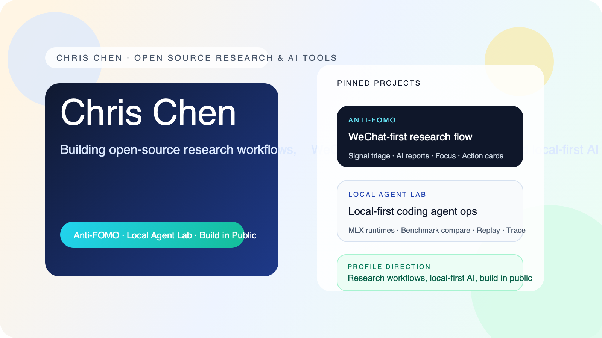

# Chris Chen

Building open-source research workflows and local-first AI tools.

## Profile visual system

- Avatar asset: `assets/profile-avatar.png`
- Social preview asset: `assets/profile-cover.png`
- Visual system notes: `docs/profile-visual-system.md`

## Pinned projects

### [Anti-FOMO](https://github.com/ChrisChen667788/antifomo)

Open-source WeChat-first research workspace for signal triage, AI-assisted reports, focus sessions, and action cards.

- Repository: https://github.com/ChrisChen667788/antifomo
- Latest release: https://github.com/ChrisChen667788/antifomo/releases/latest
- Launch discussion: https://github.com/ChrisChen667788/antifomo/discussions/9
- Good first issue: https://github.com/ChrisChen667788/antifomo/issues/5

### [Local Agent Lab](https://github.com/ChrisChen667788/local-agent-lab)

Local-first coding agent workbench for MLX local runtimes, benchmark ops, replay, trace review, and remote model comparison.

- Repository: https://github.com/ChrisChen667788/local-agent-lab
- Latest release: https://github.com/ChrisChen667788/local-agent-lab/releases/latest
- Launch discussion: https://github.com/ChrisChen667788/local-agent-lab/discussions/17
- Good first issue: https://github.com/ChrisChen667788/local-agent-lab/issues/1

## What I am focused on

- WeChat-first collection and research workflows
- Local-first AI tooling and benchmark operations
- Turning noisy inputs into actionable output
- Building in public with contributor-friendly repos

## Notes for demo environments

Some repos here use `127.0.0.1`, `localhost`, or local-only callback examples in quickstart sections.

Those values are for local demos and smoke tests only.

If you deploy one of these projects to the cloud, replace local addresses with:

- your own frontend domain
- your own backend API base URL
- your own webhook or callback endpoints
- your own Mini Program `AppID` or browser-extension configuration where needed

## Open-source entry points

- Anti-FOMO launch kit: https://github.com/ChrisChen667788/antifomo/blob/main/docs/open-source-launch-kit.md
- Anti-FOMO growth copy: https://github.com/ChrisChen667788/antifomo/blob/main/docs/open-source-growth-copy.md
- Local Agent Lab launch kit: https://github.com/ChrisChen667788/local-agent-lab/blob/main/docs/open-source-launch-kit.md
- Local Agent Lab growth copy: https://github.com/ChrisChen667788/local-agent-lab/blob/main/docs/open-source-growth-copy.md
